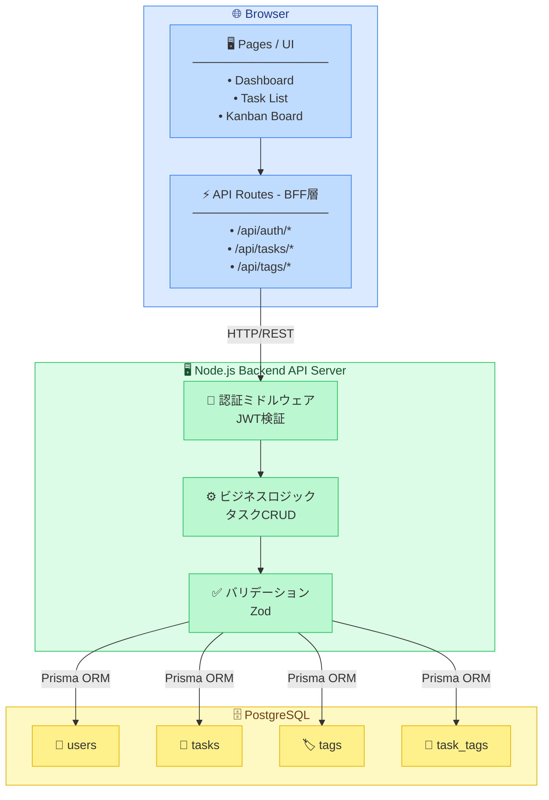
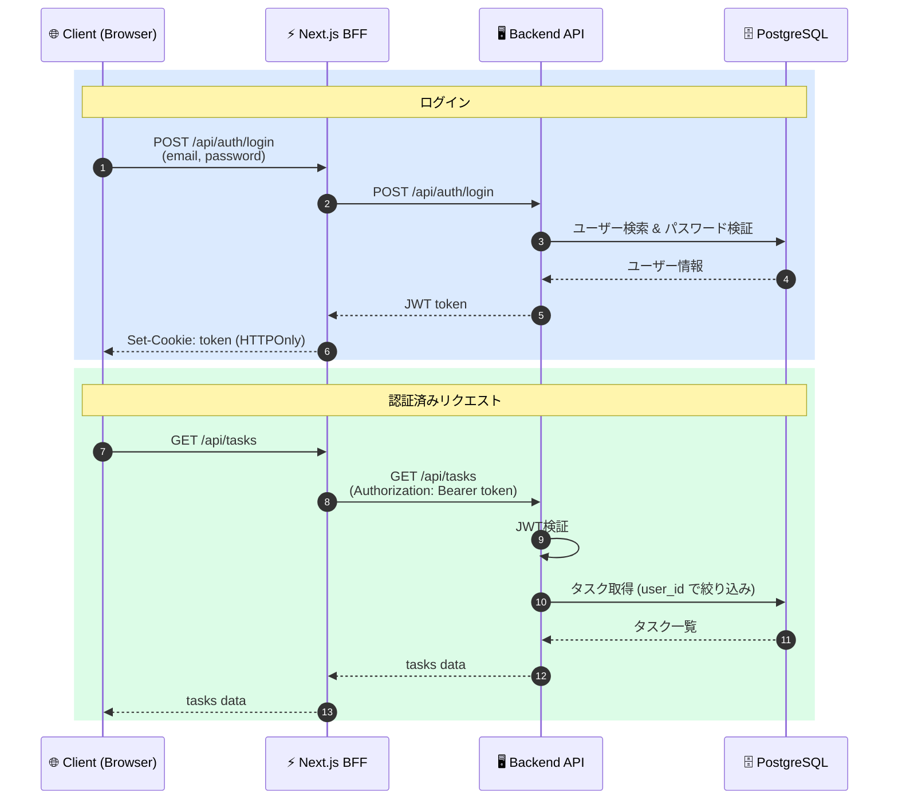

# TODOアプリ システムアーキテクチャ

> 関連ドキュメント: [設計書 (design-doc.md)](./design-doc.md)

---

## 1. システム構成図

---

## 2. 技術スタック

| レイヤー | 技術                                                 |
|----------|----------------------------------------------------|
| フロントエンド | Next.js 16+ (App Router), TypeScript, Tailwind CSS |
| 状態管理 | React Query (TanStack Query)                       |
| バックエンド | Node.js + Express または Fastify                      |
| 認証 | JWT (jsonwebtoken) + bcrypt                        |
| ORM | Prisma                                             |
| データベース | PostgreSQL                                         |
| バリデーション | Zod                                                |

---

## 3. レイヤー詳細

### 3.1 フロントエンド (Next.js)

- **App Router** を使用し、ページ・レイアウト・APIルートを一元管理
- **API Routes (BFF)** がバックエンドAPIへのプロキシ兼セッション管理を担当
- **React Query** でサーバー状態のキャッシュ・取得・更新を管理

### 3.2 バックエンド (Node.js)

- **REST API** として設計し、Next.js BFF経由でのみアクセス
- **Prisma ORM** でPostgreSQLとの型安全なデータ操作
- **Zod** でリクエストボディのバリデーション

### 3.3 データベース (PostgreSQL)

- **Prisma Migrate** でスキーマ管理・マイグレーション
- タスクは論理削除（`deleted_at`）で管理
- ユーザーごとにデータを完全分離

---

## 4. 認証フロー

---

## 5. デプロイ構成（予定）

デプロイ先は未定。候補として以下を検討：

| 候補 | フロントエンド | バックエンド | DB |
|------|---------------|-------------|-----|
| Vercel + Railway | Vercel | Railway | Railway PostgreSQL |
| Vercel + Render | Vercel | Render | Render PostgreSQL |
| AWS | Amplify / CloudFront | ECS / Lambda | RDS |
