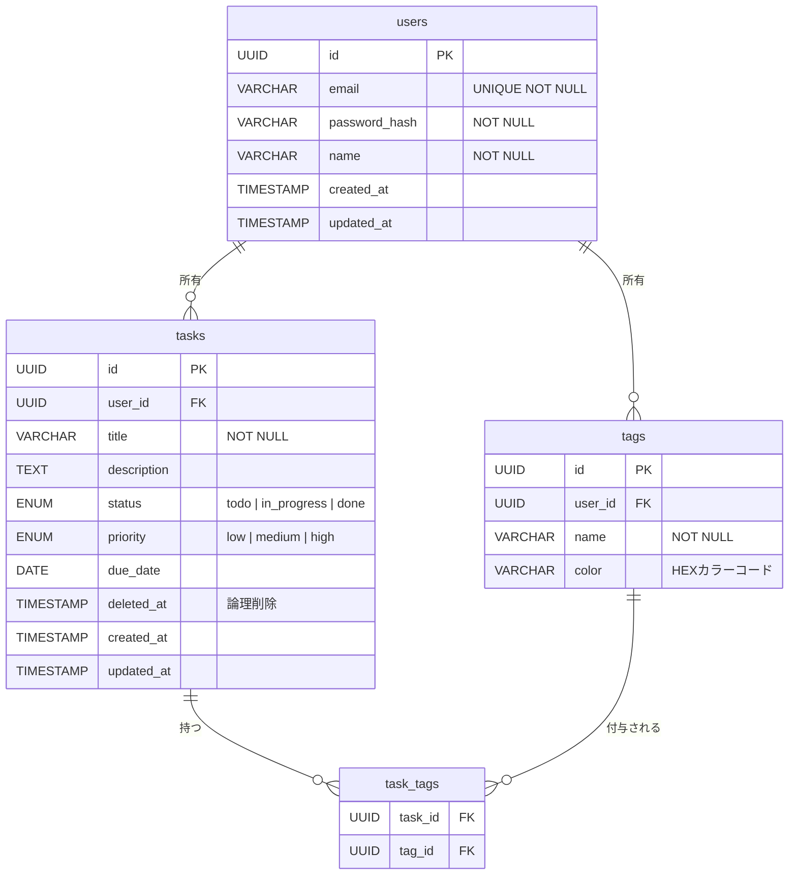

# TODOアプリ データモデル

> 関連ドキュメント: [設計書 (design-doc.md)](./design-doc.md)

---

## 1. ER図

---

## 2. テーブル定義

### 2.1 users

| カラム | 型 | 制約 | 説明 |
|--------|-----|------|------|
| `id` | UUID | PK | ユーザーID |
| `email` | VARCHAR(255) | UNIQUE, NOT NULL | メールアドレス |
| `password_hash` | VARCHAR(255) | NOT NULL | bcryptハッシュ |
| `name` | VARCHAR(100) | NOT NULL | 表示名 |
| `created_at` | TIMESTAMP | NOT NULL | 作成日時 |
| `updated_at` | TIMESTAMP | NOT NULL | 更新日時 |

### 2.2 tasks

| カラム | 型 | 制約 | 説明 |
|--------|-----|------|------|
| `id` | UUID | PK | タスクID |
| `user_id` | UUID | FK → users.id | 所有ユーザー |
| `title` | VARCHAR(255) | NOT NULL | タイトル |
| `description` | TEXT | nullable | 詳細説明 |
| `status` | ENUM | NOT NULL, DEFAULT `todo` | ステータス |
| `priority` | ENUM | NOT NULL, DEFAULT `medium` | 優先度 |
| `due_date` | DATE | nullable | 期限 |
| `deleted_at` | TIMESTAMP | nullable | 論理削除日時 |
| `created_at` | TIMESTAMP | NOT NULL | 作成日時 |
| `updated_at` | TIMESTAMP | NOT NULL | 更新日時 |

### 2.3 tags

| カラム | 型 | 制約 | 説明 |
|--------|-----|------|------|
| `id` | UUID | PK | タグID |
| `user_id` | UUID | FK → users.id | 所有ユーザー |
| `name` | VARCHAR(50) | NOT NULL | タグ名 |
| `color` | VARCHAR(7) | nullable | HEXカラーコード（例: `#3b82f6`） |

### 2.4 task_tags

| カラム | 型 | 制約 | 説明 |
|--------|-----|------|------|
| `task_id` | UUID | PK, FK → tasks.id | タスクID |
| `tag_id` | UUID | PK, FK → tags.id | タグID |

---

## 3. ENUM定義

### 3.1 ステータス (`status`)

| 値 | 説明 | カンバン列 |
|-----|------|-----------|
| `todo` | 未着手 | Todo |
| `in_progress` | 進行中 | In Progress |
| `done` | 完了 | Done |

### 3.2 優先度 (`priority`)

| 値 | 説明 | 表示色 |
|-----|------|--------|
| `high` | 高優先度 | 赤 |
| `medium` | 中優先度 | 黄 |
| `low` | 低優先度 | 緑 |
