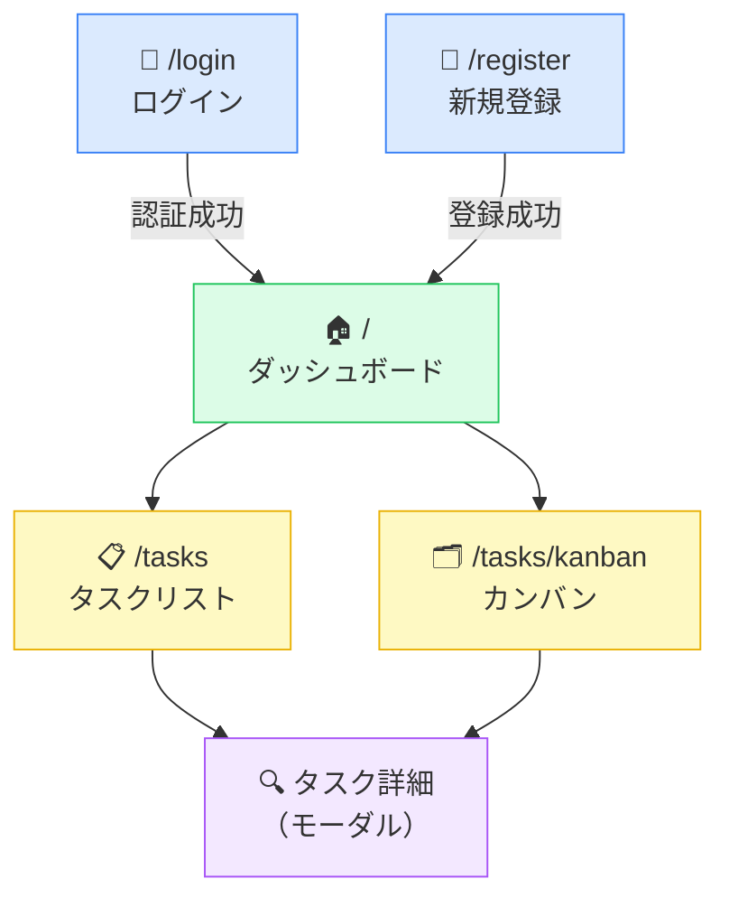

# TODOアプリ 画面設計

> 関連ドキュメント: [設計書 (design-doc.md)](./design-doc.md)

---

## 1. 画面一覧

| 画面名 | パス | 説明 |
|--------|------|------|
| ログイン | `/login` | メール・パスワードでログイン |
| 新規登録 | `/register` | ユーザー作成 |
| ダッシュボード | `/` | 期限切れ・今日期限・サマリ表示 |
| タスクリスト | `/tasks` | タスク一覧（リスト表示）|
| カンバン | `/tasks/kanban` | タスク一覧（カンバン表示）|

---

## 2. 画面遷移



---

## 3. 主要コンポーネント構成

```
app/
├── (auth)/
│   ├── login/page.tsx
│   └── register/page.tsx
├── (dashboard)/
│   ├── layout.tsx          ← ナビゲーションバー
│   ├── page.tsx            ← ダッシュボード
│   └── tasks/
│       ├── page.tsx        ← タスクリスト
│       └── kanban/page.tsx ← カンバンボード
└── api/
    ├── auth/
    │   ├── register/route.ts
    │   ├── login/route.ts
    │   └── logout/route.ts
    └── tasks/
        ├── route.ts        ← GET (一覧), POST (作成)
        └── [id]/route.ts   ← GET, PUT, DELETE
```
